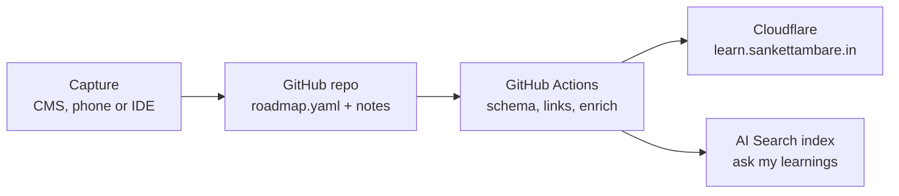

# AI Architect 60-Day Plan — Consolidated

Sep 25, 2026 · @Sanket

## Summary

In 60 days (28 September – 26 November 2026), become interview-ready for senior AI roles at product companies and GCCs. The target role blends Applied AI / LLM Engineer, GenAI Solutions Architect, and Data + AI Platform Architect. This edition merges the original plan with the September 2026 deep research. It keeps the topics and order, cuts the build scope to fit about 145 hours, and updates several items that the 2026 ecosystem has moved past.

| Constraint | Value |
| --- | --- |
| Time | 2 h weekdays, 3–4 h weekends ≈ 17 h/week ≈ 145 h total |
| Budget | ≤ $20/month for LLM APIs and cloud |
| Starting strengths | 5 years full-stack (React, Next.js, GraphQL, FastAPI, Spring Boot), Databricks, Snowflake, AWS Lambda, Terraform, Linux (RHCSA) |
| Existing AI work | Portfolio RAG; RunCoach AI in Runfolio (RAG + pgvector + streaming agent); AI-assisted extraction in the AI Pune directory |
| Output | Four upgraded portfolio projects + a public, forkable learning hub at learn.sankettambare.in |
| Fixed date | Khadakwasla Ultra on day 56 (22 November): days 55–56 are rest |

**What the research changed:**

1. **Scope cut, not topics.** The original plan as written needed roughly 200–220 hours. It now keeps the 4 core projects and folds three ideas into them (claim checking into Core 1's evals, document extraction into Core 3, the LLM gateway into Core 4). A QLoRA fine-tune stays as an optional weekend. Everything else moves to a days 61–90 backlog.
2. **Security moves earlier.** Prompt injection and tool permissions move to week 5, alongside MCP, because MCP servers are where injection turns into an actual exploit.
3. **Two threads run across all 8 weeks.** Cost logging starts in week 2, and context engineering is taught explicitly in weeks 5–6.
4. **Week 7 goes deep on Databricks and light on Snowflake.** The Snowflake trial starts on day 43.
5. **Several references are updated to 2026 versions:** the OWASP LLM Top 10 2026 plus the Agentic Top 10, the MCP `2026-07-28` spec, and tool ownership changes. See the budget and ecosystem section.
6. **Only two paid items are worth buying:** Chip Huyen's *AI Engineering* and the ByteByteGo *Generative AI System Design Interview* book.

**How to read resource tables:** ✅ means it was checked against a primary or first-party page in September 2026. ◐ means it is well known but should be checked before publishing to the hub. Priority is Must, Recommended or Optional.

## Plan at a glance

Every week runs three tracks: **Learn**, **Build** (one project at a time) and **Interview**. Build carries the most weight, because product-company interviews probe what you shipped and measured.

| Week | Days | Learn | Build | Interview |
| --- | --- | --- | --- | --- |
| 1 | 1–7 | How LLMs work: tokens, attention, sampling, context windows; LLM APIs | Learning hub v0, timeboxed to 6 h | OOP and SOLID; DSA arrays and hashing |
| 2 | 8–14 | Prompting, structured outputs, embeddings, evals methodology; **start cost logging** | Core 1: audit the portfolio RAG, write a labelled 40–50 question eval set | Design patterns (strategy, factory, observer, adapter); DSA two pointers, sliding window |
| 3 | 15–21 | RAG core: chunking, pgvector, hybrid BM25 + vector, reranking, query rewriting | Core 1: RAG v2, measured against v1 | Load balancing, caching, replication, sharding |
| 4 | 22–28 | Advanced RAG: contextual retrieval, citations, LLM-as-judge calibration; 3 h GraphRAG spike | Core 1: eval report on 3+ configurations, with claim-level answer checks | GenAI drill: RAG over 10M documents with access control |
| 5 | 29–35 | Agents, tool design, MCP `2026-07-28`, **context engineering, prompt injection, tool permissions** | Core 2: upgrade RunCoach AI with an MCP server and approval step | Queues, async, rate limiting, idempotency |
| 6 | 36–42 | Agent frameworks, human-in-the-loop, tracing, agent evals, multi-agent | Core 2: tracing, agent evals, cost per conversation | LLD: parking lot, rate limiter, LRU cache |
| 7 | 43–49 | Databricks deep (Vector Search, Mosaic AI Agent Framework, MLflow, Unity Catalog); Snowflake light (Cortex Analyst) | Core 3: document ingestion → lakehouse → RAG + text-to-SQL | GenAI drill: enterprise assistant with access control |
| 8 | 50–54 | LLMOps: routing, semantic cache, cost/latency budgets, inference basics, OWASP LLM and Agentic Top 10 2026 | Core 4: LLM gateway, then load-test and monitor Core 1 or 2 through it | 3 mocks: GenAI design, classic design, LLD |
| Race | 55–56 | Rest | — | Khadakwasla Ultra on day 56 |
| Final | 57–60 | Light revision from your own hub notes | Polish READMEs, demo videos, resume | 4th mock (behavioural); STAR story bank of 8 stories |

### Hours budget

| Track | Original plan | Consolidated plan |
| --- | --- | --- |
| Learn | \~55 h | \~45 h |
| Build | \~110–130 h (4 core + 7 ideas + hub) | \~65 h (4 core + hub) |
| Interview | \~35 h | \~35 h |
| **Total** | **\~200–220 h** | **\~145 h** |

These are estimates. They assume 12–18 h of real debugging time for each production-quality RAG or agent upgrade.

### Daily rhythm

**Weekdays (2 h):**

1. 50 min learn: one lecture, chapter, essay or course module.
2. 55 min build. On Tue/Thu, 30 of these minutes go to DSA.
3. 15 min capture: log what you learned in the hub.

**Weekends (3–4 h):**

1. 2–2.5 h deep build block.
2. 45 min interview practice: one design or LLD problem, written up in the hub.
3. 30 min weekly review: update progress, read your 3–4 news sources, and write a short weekly note (it can double as a Substack post).

### Checkpoints

- [ ] Day 7: hub live on the subdomain with the week 1 log
- [ ] Day 14: eval set labelled; cost logging on
- [ ] Day 28: Core 1 live with a published eval report
- [ ] Day 42: Core 2 demo video, traces and agent eval results
- [ ] Day 49: Core 3 repo with architecture diagram and text-to-SQL accuracy on 20 questions
- [ ] Day 54: Core 4 load-test results; three mocks done
- [ ] Day 60: resume, portfolio and 8 STAR stories updated

## Resources: weeks 1–4

Prefer fewer, better resources: finish the Must items, and use the rest as references.

### Week 1 — How LLMs work + APIs

| Resource | Type | Cost | Time | Why | Priority | Check |
| --- | --- | --- | --- | --- | --- | --- |
| Andrej Karpathy, "Deep Dive into LLMs like ChatGPT" (YouTube, Feb 2025) | Video | Free | \~3.5 h | Full stack in one talk: data, tokenization, transformer, sampling, SFT, RL, hallucinations, tool use | Must | ✅ |
| 3Blue1Brown, Neural Networks series: transformer and attention chapters | Video | Free | 1.5 h | Clearest visual intuition for attention and embeddings | Must | ◐ |
| [anthropics/courses](https://github.com/anthropics/courses) — API fundamentals | Notebooks | Free (\~$1–2 API) | 2 h | Official SDK course; swap the old Claude 3 Haiku model IDs for current ones | Must | ✅ |
| Anthropic, OpenAI and Gemini API docs | Docs | Free | 2 h | Messages, tool calling, structured output, streaming, prompt caching, batch | Must | ◐ |
| Chip Huyen, *AI Engineering* (O'Reilly), ch. 1–2 | Book | Paid | 3 h now, \~15 h total | The spine of the plan; later chapters cover evals, RAG, agents, fine-tuning, inference | Recommended (buy this one) | ◐ |
| Karpathy, "Let's build the GPT Tokenizer" | Video | Free | 2 h | Only if tokens still feel fuzzy | Optional | ◐ |

Interview: [Refactoring.Guru](https://refactoring.guru) SOLID and patterns pages, plus 6–8 NeetCode array/hashing problems.

### Week 2 — Prompting, structured outputs, embeddings, evals

| Resource | Type | Cost | Time | Why | Priority | Check |
| --- | --- | --- | --- | --- | --- | --- |
| [Anthropic prompt engineering interactive tutorial](https://github.com/anthropics/prompt-eng-interactive-tutorial) | Course | Free | 3 h (ch. 1–6, 9) | 9 chapters with exercises; the techniques transfer to all providers | Must | ✅ |
| [anthropics/courses](https://github.com/anthropics/courses) — Real world prompting, Prompt evaluations | Course | Free | 3 h | Feeds directly into your eval set | Must | ✅ |
| Hamel Husain & Shreya Shankar, [AI Evals FAQ](https://hamel.dev/blog/posts/evals-faq/) + [free email course](https://ai.hamel.dev/eval-course) | Essay, email course | Free (Maven cohort paid) | 3 h | Error analysis first, then binary judge scores; the most-cited evals method | Must | ✅ |
| [Instructor](https://python.useinstructor.com) + OpenAI Structured Outputs guide | Docs | Free | 1.5 h | Pydantic-typed outputs with retries; reused in Cores 1 and 3 | Recommended | ✅ / ◐ |
| Sentence-Transformers docs + [MTEB leaderboard](https://huggingface.co/spaces/mteb/leaderboard) | Docs | Free | 1 h | Choosing embedding models; always confirm on your own data | Recommended | ◐ |

Build note: label every eval question by type (factual, multi-hop, not in corpus, adversarial) before touching RAG v2. Log tokens and cost per request from this week.

### Week 3 — RAG core

| Resource | Type | Cost | Time | Why | Priority | Check |
| --- | --- | --- | --- | --- | --- | --- |
| [NirDiamant/RAG\_Techniques](https://github.com/NirDiamant/RAG_Techniques) | Repo | Free | 3 h (chunking, fusion, reranking, query transforms) | Broadest runnable catalogue of techniques. **Non-commercial license: link to it, don't copy notebooks into the hub** | Must | ✅ |
| Supabase docs: pgvector and hybrid search; pgvector README (HNSW vs IVFFlat) | Docs | Free | 2 h | Your exact stack; shows RRF fusion of full-text and vector search in SQL | Must | ◐ |
| Rerankers: open `BAAI/bge-reranker` models or Cohere Rerank | Model, docs | Free / free tier | 1 h | Cross-encoder reranking; bge runs on CPU for a small corpus | Recommended | ◐ |
| *AI Engineering* ch. 6 | Book | Paid | 2 h | Term-based vs embedding retrieval trade-offs | Recommended | ◐ |
| [donnemartin/system-design-primer](https://github.com/donnemartin/system-design-primer) + ByteByteGo YouTube | Repo, video | Free | 4 h | Interview track: load balancing, caching, replication, sharding | Must | ✅ / ◐ |
| Kleppmann, *Designing Data-Intensive Applications*, ch. 5–6 | Book | Paid | 3 h | Depth on replication and partitioning; you likely know much of it already | Optional | ◐ |

### Week 4 — Advanced RAG + RAG evals

| Resource | Type | Cost | Time | Why | Priority | Check |
| --- | --- | --- | --- | --- | --- | --- |
| Anthropic, [Contextual Retrieval](https://www.anthropic.com/engineering/contextual-retrieval) + cookbook | Essay, notebook | Free (\~$1–3 API) | 2 h | Retrieval failures fall 35% with contextual embeddings, 49% with contextual BM25 added, 67% with reranking; also the "under \~200k tokens, skip RAG" rule | Must | ✅ |
| Hamel Husain, "LLM-as-a-Judge: A Complete Guide" (via [hamel.dev evals notes](https://hamel.dev/notes/llm/evals/)) | Essay | Free | 1.5 h | Calibrating judges against your own labels; powers the claim checks in Core 1 | Must | ✅ |
| Ragas **or** DeepEval | Library | Free (OSS) | 2 h | RAG metrics (faithfulness, context precision/recall). Pick one, not both | Must (pick one) | ◐ |
| [neo4j/neo4j-graphrag-python](https://github.com/neo4j/neo4j-graphrag-python) | Repo | Free (AuraDB Free or Docker) | 3 h spike | First-party GraphRAG: KG pipeline, vector + Cypher retrieval, Text2Cypher | Recommended | ✅ |
| microsoft/graphrag | Repo | Free, but indexing is LLM-expensive | 1 h reading | Know the community-summaries idea; don't run a full index on this budget | Optional | ◐ |
| Aminian & Sheng, *Generative AI System Design Interview*, ch. 1, 4, 6 ([Shroff edition](https://www.shroffpublishers.com/books/9789355424969/)) | Book | ₹1,900 | 3 h now | 7-step framework; RAG and chat-assistant designs. Ch. 7–11 (image/video) are low priority | Recommended (buy this one) | ✅ |

## Resources: weeks 5–8 and final days

### Week 5 — Agents, MCP, context engineering, agent security

| Resource | Type | Cost | Time | Why | Priority | Check |
| --- | --- | --- | --- | --- | --- | --- |
| [Anthropic Engineering](https://www.anthropic.com/engineering): "Building effective agents", "Writing effective tools for agents", "Effective context engineering for AI agents" | Essays | Free | 2.5 h | The standard vocabulary: workflows vs agents, tool design, context as a finite budget | Must | ✅ |
| [MCP spec 2026-07-28 release post](https://blog.modelcontextprotocol.io/posts/2026-07-28/) | Docs | Free | 2 h | New stateless core (no initialize handshake or session ID), multi round-trip requests; Roots, Sampling and Logging deprecated. Build against this version | Must | ✅ |
| Hugging Face MCP Course, units 1–2 | Course | Free | 6–8 h | Hands-on servers and clients; the full course is 10–15 h, so stop after unit 2 | Must | ✅ |
| [modelcontextprotocol/servers](https://github.com/modelcontextprotocol/servers) + [MCP Registry](https://registry.modelcontextprotocol.io) | Repo | Free | 1.5 h | Now 7 reference servers; read Filesystem (path allow-listing) and Fetch for input validation | Recommended | ✅ |
| [OWASP Top 10 for Agentic Applications 2026](https://genai.owasp.org/resource/owasp-top-10-for-agentic-applications-for-2026/) | Standard | Free | 1 h | Moved here from week 8: goal hijack, tool misuse, privilege abuse map directly onto your MCP tools | Must | ✅ |
| Anthropic, "Code execution with MCP" | Essay | Free | 0.5 h | Why large tool catalogues blow up context | Recommended | ✅ |

Interview: Stripe's idempotency-keys post and a rate-limiter design (ByteByteGo video, or Alex Xu *System Design Interview* vol. 1).

### Week 6 — Frameworks, human-in-the-loop, tracing, agent evals

| Resource | Type | Cost | Time | Why | Priority | Check |
| --- | --- | --- | --- | --- | --- | --- |
| LangChain Academy, Introduction to LangGraph ([notebooks](https://github.com/langchain-ai/langchain-academy)) | Course | Free | 6 h (modules 1–4) | State, memory and interrupts for approval steps | Must | ✅ |
| DeepLearning.AI, [Evaluating AI Agents](https://www.deeplearning.ai/courses/evaluating-ai-agents) | Short course | Free (confirm on your account) | 1.5 h | Trajectory, router and skill evals | Must | ✅ |
| Langfuse (MIT; self-host or cloud free tier) | Tool, docs | Free | 2 h | Tracing, datasets, cost per conversation; OpenTelemetry-based | Must | ✅ |
| Claude Agent SDK and OpenAI Agents SDK docs | Docs | Free | 2 h | Enough to compare three frameworks; build in one | Recommended | ◐ |
| Anthropic, "How we built our multi-agent research system" | Essay | Free | 1 h | Best real-world orchestrator-worker write-up, with token cost and evals | Recommended | ✅ |
| HF Context Course (April 2026) | Course | Free | 2–3 h (selected units) | Context engineering in practice | Optional | ✅ |
| microsoft/ai-agents-for-beginners, NirDiamant/GenAI\_Agents | Repos | Free | Reference | Pattern catalogues; GenAI\_Agents is also non-commercial | Optional | ◐ / ✅ |

LLD: [ashishps1/awesome-low-level-design](https://github.com/ashishps1/awesome-low-level-design) — parking lot, LRU cache, rate limiter.

### Week 7 — Data + AI platform

| Resource | Type | Cost | Time | Why | Priority | Check |
| --- | --- | --- | --- | --- | --- | --- |
| [Databricks Free Edition limitations](https://docs.databricks.com/aws/en/getting-started/free-edition-limitations) | Docs | Free | 0.5 h | Design around: serverless only, one vector search endpoint, one app (24 h runtime), no Agent Bricks, non-commercial | Must | ✅ |
| Databricks Academy, Generative AI Engineering learning path | Course | Content free; exam paid | 6 h (selected modules) | Vector Search, Mosaic AI Agent Framework, MLflow eval, Unity Catalog in GCC vocabulary | Must | ◐ |
| MLflow 3 GenAI docs (tracing, evaluate, judges) | Docs | Free | 1.5 h | Tracing and evals inside the lakehouse | Recommended | ◐ |
| Snowflake quickstarts: [Cortex Analyst](https://www.snowflake.com/en/developers/guides/getting-started-with-cortex-analyst-in-snowflake/), [Cortex Agent from scratch](https://www.snowflake.com/en/developers/guides/build-a-cortex-agent-from-scratch-with-snowflake/) | Tutorials | Trial: $400 / 30 days | 4 h | Semantic model + text-to-SQL; some quickstarts are unmaintained, so expect small API drift | Must | ✅ |
| DeepLearning.AI, [Building and Evaluating Data Agents](https://www.deeplearning.ai/short-courses/building-and-evaluating-data-agents/) | Short course | Free for a limited time | 1.5 h | Planning over structured + unstructured data, with evals | Recommended | ✅ |

### Week 8 — LLMOps, security, cost

| Resource | Type | Cost | Time | Why | Priority | Check |
| --- | --- | --- | --- | --- | --- | --- |
| [OWASP Top 10 for LLM Applications 2026](https://genai.owasp.org/resource/owasp-genai-llm-top-10-2026/) (3 August 2026) | Standard | Free | 2 h | Replaces the 2025 list. Reported order: prompt injection, sensitive info disclosure, excessive agency, supply chain, poisoning, unbounded consumption, misinformation, hidden context exposure, vector weaknesses, improper output handling. Confirm against the PDF | Must | ✅ (order ◐) |
| [BerriAI/litellm](https://github.com/BerriAI/litellm) | Repo | Free (OSS core) | 3 h | Reference for routing, fallbacks, budgets, spend tracking, semantic cache. **Pin versions:** releases 1.82.7–1.82.8 were flagged as malicious, and a critical SQL injection was exploited in 2026 | Must | ✅ |
| [Portkey-AI/gateway](https://github.com/Portkey-AI/gateway) | Repo | Free (Apache-2.0) | 1 h reading | TypeScript contrast: config-driven routing and guardrails | Recommended | ✅ |
| promptfoo (OSS, OpenAI-owned since March 2026) | CLI | Free | 2 h | Eval regressions and red-team scans in GitHub Actions | Must | ✅ |
| Grafana k6 | Tool | Free | 1.5 h | Load-test p95 latency, time-to-first-token and 429 behaviour | Recommended | ◐ |
| Microsoft Presidio | Library | Free | 1 h | PII redaction inside the gateway | Recommended | ◐ |
| *AI Engineering* ch. 7, 9–10 | Book | Paid | 3 h | Fine-tuning vs RAG; inference basics (KV cache, batching, quantization) | Recommended | ◐ |

### Final days (57–60)

- [Tech Interview Handbook](https://www.techinterviewhandbook.org) behavioural section (2 h): STAR templates and question bank.
- [alexeygrigorev/ai-engineering-field-guide](https://github.com/alexeygrigorev/ai-engineering-field-guide) ✅: what 2026 AI-engineering loops, take-homes and AI design rounds look like.
- Your own eval reports as story material: "I raised faithfulness from X to Y by changing Z" beats any template.

## Projects

All four core projects upgrade things you already built, so every interview answer starts with a live link and real numbers. Each ships with a README, architecture diagram, eval results and a 2-minute demo video.

### Already built or in progress

| Project | What it is | Role in the plan |
| --- | --- | --- |
| Runfolio / RunCoach AI (runfolio.sankettambare.in) | Running portfolio; RAG + pgvector + streaming agent over running data | Core 2 |
| Portfolio "Ask Sanket" RAG | Small RAG over the site's database | Core 1 |
| E20 ka Chakravyuh | Astro + React + D3 scrollytelling; Zod-validated, git-versioned data | Corpus for Core 3; same stack as the hub |
| The Dividend Question (youth data story) | Citation-driven data story with archived sources | Corpus for Core 3 |
| AI Pune events directory | Events + communities; AI-extracted submissions to a review queue | Extraction ideas feed Core 3 ingestion |
| Antyodaya NGO site, Yung Foundation site, school management PWA | Supabase full-stack; bilingual Marathi/English; offline-first | Data-modelling stories; bilingual data for the optional fine-tune |
| Digital wellbeing site, Khadakwasla training app, 3D card, walk-run-cycle viz | Data-driven front-end craft | Portfolio breadth |

### Core projects and what to study

| # | Project | Weeks | What it proves | Study first |
| --- | --- | --- | --- | --- |
| 1 | **"Ask Sanket" RAG v2** — hybrid search, reranking, citations, streaming, eval harness, plus claim-level checks that split each answer into claims and verify them against cited chunks | 2–4 | Taking RAG from demo to measured quality | Supabase hybrid-search SQL (RRF); Anthropic contextual-retrieval cookbook; Ragas or DeepEval; Hamel's LLM-as-judge guide. Include a "not in corpus → refuse" test category |
| 2 | **RunCoach AI v2** — MCP server for training data, multi-step planning with your approval before any change, agent evals, tracing, cost per conversation | 5–6 | Moving from chatbot to reliable, observable agent | MCP `2026-07-28` spec and official Python SDK; LangGraph interrupts; Langfuse; Filesystem reference server for permission design. Map each tool to OWASP agentic risks (tool misuse, privilege abuse) |
| 3 | **Research Desk** — PDFs and reports from E20 and The Dividend Question → typed JSON with confidence → Delta tables → vector search; plus text-to-SQL | 7 | Data + AI platform thinking: ingestion, governance, structured + unstructured retrieval | Docling (MIT) for parsing; Databricks Vector Search within Free Edition limits; [Cortex Analyst quickstart repo](https://github.com/Snowflake-Labs/sfguide-getting-started-with-cortex-analyst). Compare its semantic model with a hand-rolled schema prompt on 20 questions |
| 4 | **LLM Gateway + hardening** — thin FastAPI gateway with routing, fallbacks, semantic cache, per-project budgets, PII redaction and a cost dashboard; then load-test Core 1 or 2 through it | 8 | The architect layer: cost, latency, reliability, security | LiteLLM router and spend schema; Portkey config-driven fallbacks; Presidio; k6. Write your own thin gateway so you can explain every line |

### New ideas: verdict after research

| Idea | Verdict | Study if you do it |
| --- | --- | --- |
| N1 Claim Checker | Folded into Core 1's eval harness | Hamel's judge guide; DeepMind long-form factuality (SAFE) paper; UK AISI inspect\_ai |
| N2 Document/event extraction | Folded into Core 3 ingestion | Docling (MIT, default); Marker (strong on born-digital PDFs, but GPL-3.0 code and restricted model weights); Unstructured; Instructor |
| N3 LLM Gateway | Merged into Core 4 | As Core 4 |
| N4 LoRA/QLoRA fine-tune | **Optional weekend (6–8 h)**, days 61–90 or instead of a spare weekend if ahead | Unsloth free Colab notebooks; [mlabonne/llm-course](https://github.com/mlabonne/llm-course) fine-tuning section; HF smol course; AI4Bharat datasets for Marathi (check licenses) |
| N5 Event-driven pipeline | Backlog; mention incremental re-embedding (hash per chunk) in Core 1 instead | Supabase database webhooks; Databricks Delta Sync |
| N6 GraphRAG | 3-hour spike in week 4 only | neo4j-graphrag-python; microsoft/graphrag; HKUDS/LightRAG |
| N7 Kubernetes + Terraform + OTel | Backlog; deploy Core 4 as one small container instead | OpenTelemetry Demo; kind |

### README template (your interview script)

1. What problem, for whom, and why an LLM at all?
2. Architecture diagram and the 2–3 key trade-offs.
3. Eval method and before/after numbers: accuracy, faithfulness, p95 latency, cost per query.
4. Failure modes found and how you handled them.
5. What you would change at 100× scale.

## Interview prep

Prepare three fully rehearsed GenAI designs: enterprise RAG, an agent with tools and approval, and an LLM gateway. Expect cost, evals and safety to be scored explicitly. Keep DSA light but not zero.

**What 2026 loops look like:**

- Exponent (now Aced) [reports](https://www.tryexponent.com/blog/system-design-interview-guide) a higher system-design bar, LLM-infrastructure prompts inside general loops, and cost being graded explicitly.
- Candidate reports for Indian GenAI roles describe: screening, 1–2 technical rounds with live coding plus GenAI architecture discussion, then managerial and HR rounds (small sample).
- Product companies hiring "Software Engineer (AI)" usually still run 1–2 LeetCode-medium rounds. GCC architect loops weight design, cloud and project deep dives more. (This is judgement from candidate reports, not published data.)

**DSA plan:** about 50 problems from [NeetCode 150](https://neetcode.io), filtered to arrays/hashing, two pointers, sliding window, stack, heap, trees, graphs/BFS and intervals. Tue/Thu, 30 minutes.

| Resource | Type | Cost | Priority |
| --- | --- | --- | --- |
| Aminian & Sheng, *Generative AI System Design Interview* (ch. 1, 4, 6) | Book | ₹1,900 | Must |
| [alexeygrigorev/ai-engineering-field-guide](https://github.com/alexeygrigorev/ai-engineering-field-guide) | Repo | Free | Must |
| [PracHub GenAI & LLM system design guide](https://prachub.com/resources/genai-llm-system-design-interview-guide-2026) | Article | Free | Recommended |
| [ashishps1/awesome-low-level-design](https://github.com/ashishps1/awesome-low-level-design) | Repo | Free | Must (LLD) |
| ByteByteGo | YouTube free; platform paid | Mixed | Recommended |
| Mocks: Exponent/Aced peer practice (free tier), Pramp, interviewing.io (paid), Topmate mentors in India (paid) | Platforms | Mixed | Recommended: at least 4 (2 GenAI design, 1 LLD, 1 behavioural) |

### 12 questions to rehearse

1. Design RAG over 10M documents with per-user access control.
2. RAG vs long context vs fine-tuning: when is each right?
3. How do you evaluate a RAG system, and how do you know your judge is right?
4. Design an agent that takes real actions safely: human approval, least privilege, idempotency.
5. MCP vs plain function calling.
6. Cut LLM cost by 60% without losing quality: caching, routing, prompt caching, batch, smaller models.
7. Prompt-injection defences for tool-using agents.
8. Semantic cache: what to cache, and how to invalidate it.
9. Multi-tenant LLM gateway with per-team budgets.
10. Text-to-SQL: accuracy and safety.
11. Observability: what goes in a trace, and which SLOs?
12. Latency budget for streaming chat: time to first token vs total time.

## Learning hub: a forkable repository

Build the hub with **Astro Starlight + one `roadmap.yaml` + lychee link checks + Cloudflare hosting**, and add Cloudflare AI Search later for an "ask my learnings" chat. Choose Starlight over Fumadocs because the hub is Markdown-first; Fumadocs (Next.js) is the pick only if you want React-heavy pages. Timebox it to about 6 h in week 1 and 1 h/week after that.

### Architecture



Every edit is a commit. CI validates it, then the site and the search index update together.

### Repository structure

```
ai-architect-60-days/
├── data/roadmap.yaml          # single source: weeks, resources, projects
├── data/roadmap.schema.json   # CI fails on bad entries
├── src/content/docs/weeks/    # one page per week, generated from roadmap.yaml
├── src/content/docs/notes/    # your topic notes
├── src/content/log/           # one file per day
├── projects/                  # links + READMEs for the 4 core projects
├── .github/workflows/         # validate, lychee, enrich, weekly digest, deploy
├── CONTRIBUTING.md            # how others add or fix resources
└── LICENSE                    # CC BY 4.0 for notes, MIT for code
```

A resource entry:

```
- id: hamel-evals-faq
  week: 2
  title: AI Evals FAQ
  url: https://hamel.dev/blog/posts/evals-faq/
  type: essay        # video | course | book | docs | repo | essay | standard
  cost: free
  hours: 3
  priority: must     # must | recommended | optional
  verified_on: 2026-09-25
  license: link-only  # set for non-commercial repos you must not copy
  status: todo       # todo | doing | done
  takeaways: ""
```

### Rules that make it adoptable by others

1. `roadmap.yaml` is the only source of truth; week pages are generated from it.
2. Every resource has `verified_on`; a scheduled job flags entries older than 90 days.
3. Notes are CC BY 4.0 and code is MIT. Non-commercially licensed repos (RAG\_Techniques, GenAI\_Agents) are linked, never copied.
4. A weekly lychee run opens an issue for broken links, since link rot is the main way learning repos decay.
5. Automation opens pull requests (weekly digest, enrichment drafts); it never commits straight to main.
6. Personal progress (`status`, `takeaways`) lives in fields others can reset, so a fork starts clean.

### Starters and references

| Resource | Why | Check |
| --- | --- | --- |
| [withastro/starlight](https://github.com/withastro/starlight) | Docs framework with built-in search, sidebar config, i18n; supports Astro v7 | ✅ |
| [fuma-nama/fumadocs](https://github.com/fuma-nama/fumadocs) | Next.js alternative | ✅ |
| [lycheeverse/lychee-action](https://github.com/lycheeverse/lychee-action) | Scheduled link checking in GitHub Actions | ✅ |
| [developer-roadmap](https://github.com/kamranahmedse/developer-roadmap) (now under nilbuild) | How roadmap data is kept separate from rendering | ✅ |
| [donnemartin/system-design-primer](https://github.com/donnemartin/system-design-primer) | README-first navigation and Anki decks | ✅ |
| [mlabonne/llm-course](https://github.com/mlabonne/llm-course) | Roadmap + notebooks + curated links structure | ✅ |
| [Cloudflare AI Search limits](https://developers.cloudflare.com/ai-search/platform/limits-pricing) | Free during open beta: 20,000 queries/month, 100,000 files/instance, 4 MB/file on Workers Free; inference billed separately | ✅ |

## Budget and 2026 ecosystem changes

The plan fits under $20/month: the only real spend is about $10–15 of LLM API calls. Everything else runs on free tiers or trials timed to the week you need them.

| Item | Cost | Notes |
| --- | --- | --- |
| Hub hosting (Cloudflare) | $0 | Static site |
| Cloudflare AI Search | $0 in open beta | Limits above; pricing announced 30+ days before billing |
| LLM APIs | \~$10–15/month (approximate) | Build on one or two providers: Gemini free tier + one paid. Set hard spend caps |
| Local models (Ollama) and CPU rerankers | $0 | Cheap prompt and retrieval iteration |
| Supabase (Core 1) | $0 | Free plan |
| Langfuse, promptfoo, k6, Presidio | $0 | Open source; Langfuse cloud has a free tier |
| Databricks Free Edition (Core 3) | $0 | Non-commercial; limits listed in week 7 |
| Snowflake trial (Core 3) | $0 | $400 credits or 30 days; **start on day 43**. Cortex AI functions are capped at \~10 credits/day without a card |
| Books | \~₹1,900 + *AI Engineering* | The only two paid items worth buying |

**Biggest budget risks:** running a full Microsoft GraphRAG index, and re-running LLM judges over the whole eval set on every change. Cache judge outputs keyed by a hash of (input, output, judge prompt).

### Ecosystem changes to know (and mention in interviews)

| Date | Change | What it means for you |
| --- | --- | --- |
| 3 Aug 2026 | [OWASP Top 10 for LLM Applications 2026](https://genai.owasp.org/resource/owasp-genai-llm-top-10-2026/) published | Use it instead of the 2025 list; excessive agency and unbounded consumption moved up |
| 28 Jul 2026 | [MCP spec 2026-07-28](https://blog.modelcontextprotocol.io/posts/2026-07-28/) | Stateless core; build Core 2 against it |
| Jun 2026 | TensorZero repository archived | Don't choose it for the gateway |
| 29 May 2026 | Palo Alto Networks closed its acquisition of Portkey | Gateway still open source (Apache-2.0) |
| Mar 2026 | [OpenAI to acquire Promptfoo](https://openai.com/index/openai-to-acquire-promptfoo/) | Promptfoo stays open source |
| Mar 2026 | LiteLLM supply-chain advisory (1.82.7–1.82.8) and an exploited critical SQL injection | Pin versions; a good "supply chain" interview story |
| Jan 2026 | [ClickHouse acquired Langfuse](https://clickhouse.com/blog/clickhouse-acquires-langfuse-open-source-llm-observability) | Still MIT and self-hostable |
| Dec 2025 | [OWASP Top 10 for Agentic Applications](https://genai.owasp.org/resource/owasp-top-10-for-agentic-applications-for-2026/) | Use for agents with tools and memory |
| Ongoing | Databricks Free Edition excludes Agent Bricks | Use Mosaic AI Agent Framework + MLflow in notebooks |
| Ongoing | anthropics/courses still uses Claude 3 Haiku | Swap in current model IDs |

## Staying current and next steps

Read a maximum of four sources, only during the weekend review slot (\~1.5 h/week). Anything worth keeping goes into the hub; everything else waits until after day 60.

1. [Anthropic Engineering blog](https://www.anthropic.com/engineering): agents, tools, context engineering.
2. [Hamel Husain's blog](https://hamel.dev): evals and error analysis.
3. [Simon Willison's Weblog](https://simonwillison.net): hands-on, sceptical notes on models and prompt injection.
4. [Latent Space](https://www.latent.space) podcast and AI Engineer conference talks.

Optional: ByteByteGo newsletter (system design) or The Batch (weekly overview).

### Open questions

- [ ] Confirm the start date (assumed Monday 28 September 2026).
- [ ] Astro Starlight (recommended) or Next.js + Fumadocs for the hub?
- [ ] Share GitHub repo links and the current portfolio RAG details (embedding model, vector store, LLM).
- [ ] Confirm the OWASP LLM Top 10 2026 order against the official PDF.

### Next steps

1. Scaffold the hub repo: schema, `roadmap.yaml` seeded from this document, first week page, lychee, deploy.
2. Turn weeks 1–2 into a day-by-day list.
3. Buy *AI Engineering* and the GenAI System Design book; start Karpathy's Deep Dive on day 1.

## Sources

Research conducted in September 2026. Key pages:

- [Anthropic — Contextual Retrieval](https://www.anthropic.com/engineering/contextual-retrieval)
- [Hamel Husain — AI Evals FAQ](https://hamel.dev/blog/posts/evals-faq/)
- [MCP — The 2026-07-28 Specification](https://blog.modelcontextprotocol.io/posts/2026-07-28/)
- [OWASP GenAI — LLM Top 10 2026](https://genai.owasp.org/resource/owasp-genai-llm-top-10-2026/)
- [OWASP GenAI — Top 10 for Agentic Applications](https://genai.owasp.org/resource/owasp-top-10-for-agentic-applications-for-2026/)
- [Databricks — Free Edition limitations](https://docs.databricks.com/aws/en/getting-started/free-edition-limitations)
- [Snowflake — Trial](https://www.snowflake.com/en/snowflake-trial/)
- [Cloudflare — AI Search limits and pricing](https://developers.cloudflare.com/ai-search/platform/limits-pricing)
- [OpenAI — to acquire Promptfoo](https://openai.com/index/openai-to-acquire-promptfoo/)
- [ClickHouse — welcomes Langfuse](https://clickhouse.com/blog/clickhouse-acquires-langfuse-open-source-llm-observability)
- [Portkey gateway — production gateway open-sourced](https://github.com/Portkey-AI/gateway/discussions/1576)
- [Exponent/Aced — System design interview guide 2026](https://www.tryexponent.com/blog/system-design-interview-guide)
- [PracHub — GenAI system design interview guide](https://prachub.com/resources/genai-llm-system-design-interview-guide-2026)
- [alexeygrigorev — AI engineering field guide](https://github.com/alexeygrigorev/ai-engineering-field-guide)
